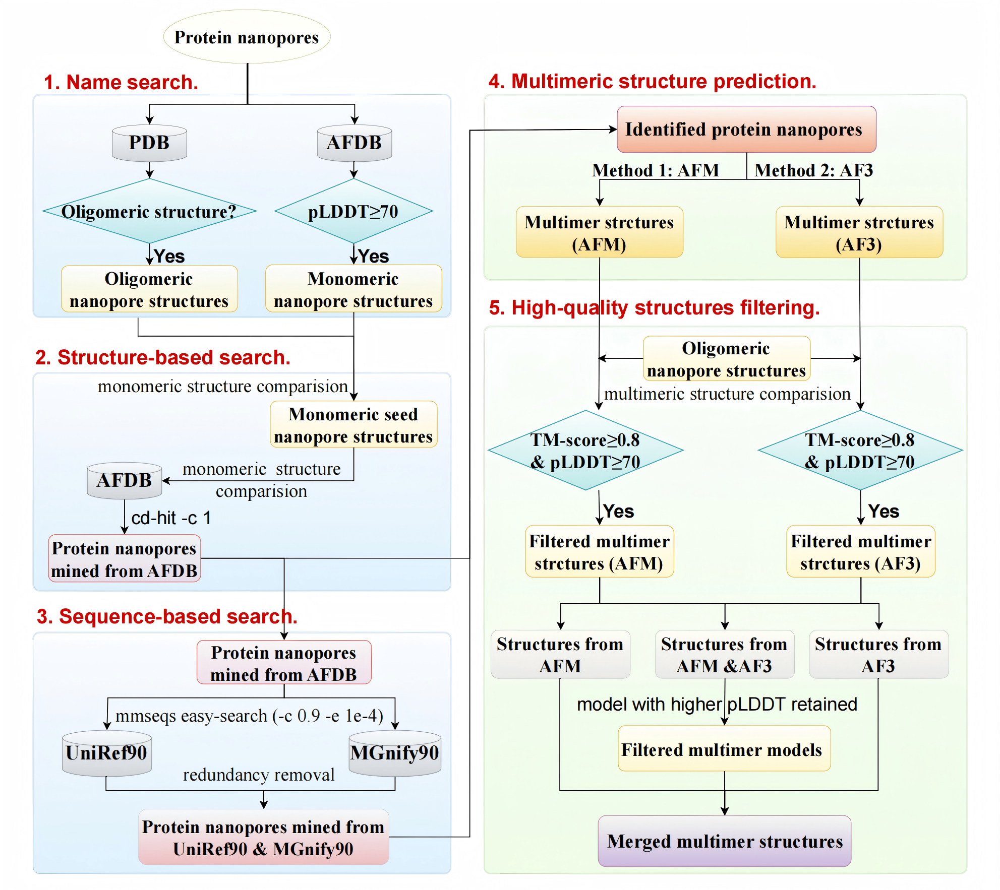

# NanoporeDB_workflow

## 1. Overview
This repository contains the integrated computational workflow for the large-scale mining, multimeric structure prediction, and quality filtering of protein nanopores. This pipeline enables the discovery of novel nanopore candidates from massive metagenomic and genomic databases.
The structural models, pore geometry analysis, and membrane orientation predictions generated by this workflow are hosted at our public database: NanoporeDB (https://db.genomics.cn/nanopore/).
## 2. Workflow Diagram

* Figure 1: Overview of the nanopore mining workflow.
## 3. Prerequisites & Installation
### 3.1 Conda Environment
We recommend using Conda to manage dependencies. To replicate the environment:

    conda env create -f environment.yml

    conda activate Foldseek
### 3.2 External Tools
Ensure the following tools are installed and accessible in your $PATH:

MMseqs2 (v15.6f4a9+; RRID:SCR_008110)

Foldseek (v8.ef4d9+)

CD-HIT (v4.8.1+; RRID:SCR_007105)

AlphaFold-Multimer (v2.3.0) & AlphaFold3 Server
## 4. Database Preparation
Before running the pipeline, download and index the required databases:
### 4.1 Foldseek pre-generated databases of AFDB
    mkdir -p Database && cd Database

    wget https://foldseek.steineggerlab.workers.dev/afdb.tar.gz

    tar -xzf afdb.tar.gz

* Path to this directory will be used in Step 2
### 4.2 Sequence Databases (UniRef90 & MGnify90)
    cd Database

### Download:
    UniRef90 (Release 2024_05)
    MGnify90 (Release 2024_04)
  
  Pre-processing (Extract Full-Length sequences):
  
    zcat mgy_clusters.fa.gz | perl -ne 'if(/^>/){$keep = /FL=1/} print if $keep' > MGnify90FL.fa

### Indexing:

    mmseqs createdb MGnify90FL.fa MGnify90FL

    mmseqs createdb uniref90.fasta uniref90
## 5. Step-by-Step Guide
### Step 1: Candidate Retrieval (Manual/Web)
PDB Search: Search keywords "nanopore", "porin" at RCSB PDB. Save oligomeric structures to 1nanopore_query/PDB_nanopore/.

AFDB Search: Search keywords at AlphaFold DB. Save monomers to 1nanopore_query/AFDB_nanopore/.

*Refer to 1nanopore_query/search_keywords.txt for the detailed query logic.
### Step 2: Structure-based Mining
Compare monomeric seed structures against AFDB using Foldseek:

    perl bin/2_structure_search.pl 1nanopore_query/PDB_nanopore 1nanopore_query/AFDB_nanopore Database [threads]
### Step 3: Sequence-based Expansion
Expand candidates by searching against UniRef90 and MGnify90FL:

    perl bin/3_sequence_search.pl Database/uniref90 Database/MGnify90FL Database/uniref90.fasta Database/MGnify90FL.fa [threads]
### Step 4: Multimeric Structure Prediction
AFM: Predict locally using AlphaFold-Multimer. Save to 4Multimer_prediction/nanopore_AFM/.

AF3: Submit to AlphaFold3 Server. Save to 4Multimer_prediction/nanopore_AF3/.

#### Consistency Check:

    python bin/4_check.py 
* Ensures IDs match between AFM (.pdb) and AF3 (.cif)

### Step 5: Quality Filtering & Merging
    perl bin/5_structure_filter.pl [threads]
## 6. Citation
If you use this workflow or NanoporeDB, please cite:
Liu et al. NanoporeDB: A Structural Resource Of Multimeric Protein Nanopores For Single-Molecule Sensing. GigaScience, 2025. DOI:[https://doi.org/10.1101/2025.11.25.690617]
